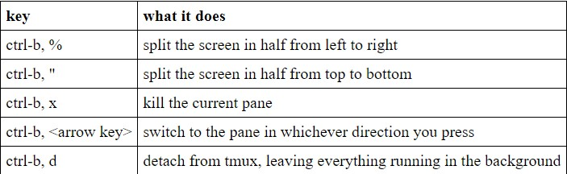
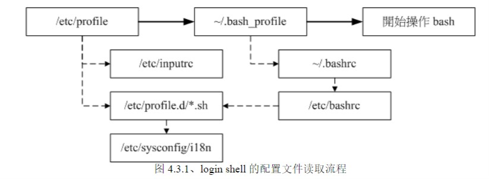
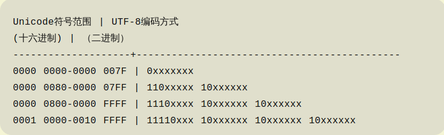

# Liunx学习笔记

- [Liunx学习笔记](#liunx学习笔记)
  - [vim编辑器常用使用指令](#vim编辑器常用使用指令)
  - [GPT与MBR磁盘格式](#gpt与mbr磁盘格式)
  - [UEFI与传统BIOS](#uefi与传统bios)
  - [终端复用器tmux使用教程](#终端复用器tmux使用教程)
  - [shell使用技巧](#shell使用技巧)
  - [bash的环境变量配置文件](#bash的环境变量配置文件)
  - [Unicode 与 UTF8 编码的关系](#unicode-与-utf8-编码的关系)

## vim编辑器常用使用指令
|命令|功能|
|:-|:-|
|`G`|移动至文件最后一列|
|`nG`|移动至第`n`列|
|`set nu, set nonu`|显示，取消列号|
|`n<Enter>`|光标向下移动`n`列|
|`/word`|查询名称为`word`的字符串|
|`:n1,n2s/word1/word2/gc`|在`n1`与`n2`列中寻找`word1`字符串将其替换为`word2`，`c`代表需要确认|
|`x,X`|小写表示向后删除，大写表示向前删除|
|`nx`|连续向后删除`n`个字符|
|`dd`|删除光标所在的一列|
|`ndd`|删除光标往后的`n`列|
|`yy`|复制光标所在一列|
|`nyy`|复制光标往后`n`列|
|`p,P`|粘贴，小写为向后粘贴，大写为向前粘贴|
|`u`|撤销|

## GPT与MBR磁盘格式
- `MBR(Master Boot Record)`是传统的磁盘格式，在**第一个扇区**(512 bytes)中存放开机管理程序(446 bytes)与分区信息(64 bytes)。一个`MBR`磁盘分区信息空间限制，最多划4个**主分区**，每个分区不得超过**2TB**

- `GPT(GUID Partition Table)`是新型的磁盘格式，与`MBR`不同，该磁盘取前34个扇区(LBA)作为磁盘信息记录与分区信息。并且使用磁盘最后34的扇区作为备份。
  - **LBA0**  
    在第一个扇区**LBA0**中与MBR一样，存放开机管理程序，但是原来MBR存放分区信息的64 bytes在GPT中被作为标志使用，标志该磁盘为GPT格式。

  - **LBA1**  
    记录的分区表本身的位置与大小，同时记录了备份用GPT分区放置的位置，此外放置了检验机制码。

  - **LBA2-33**  
    实际存放分区信息的地方，由于每个LBA含有512 bytes，每个LBA可以存放4笔分区记录。每个分区记录开始与结束，GPT在每笔记录中分别提供了64 bits用于记载分区开始与结束的位置。
  
  因此GPT磁盘格式最多能分128个分区，并且每个分区可存放更多内容。
  
## UEFI与传统BIOS
- 传统BIOS**无法识别**GPT格式硬盘，因此**无法**使用GPT磁盘作为**系统盘**。但是由于OS可以识别GPT磁盘，因此基于BIOS启动OS后，可将GPT磁盘作为文件盘使用。因此还需要一个MBR磁盘作为系统盘。

- **UEFI**可以**兼容**MBR与GPT，当使用MBR时与传统BIOS引导启动没有差异。UEFI与BIOS同属与固件内容，存储在主板**EEPROM**中。

## 终端复用器tmux使用教程
tmux主要功能有以下几点： 

- 能够使多个客户端看到同一终端的内容(会话)
- 能够使单个客户端同时看到多个会话终端的内容
- 即使所有客户端退出该会话，该会话终端的程序不会中止，会持续在后台运行。（主要针对远程调试以及跑代码）

tmux安装使用方法：  

- 安装
  - *Debian*使用`apt install tmux`可直接安装

- 使用
  - 会话部分
    - 创建会话使用`tmux new -s <session-name>`
    - 直接使用`tmux`命令也可以默认重新创建一个新的会话，其名字根据数字大小排列(0,1,2···)
    - 分离会话使用`tmux detach` 或 `ctrl + b, d`快捷键
    - 显示当前所有会话使用`tmux ls`
    - 接入会话使用`tmux attach -t <session-name>`
    - 杀死会话使用`tmux kill-session -t <session-name>`
    - 切换会话使用`tmux switch -t <session-name>`
    - 重命名会话使用`tmux rename-seesion -t <old-name> <new-name>`
  - 窗口管理部分(注意**区分窗口与窗格**)
    - 新建窗口使用`tmux new-window -n <window-name>`
    - 切换窗口使用`tmux select-window`
    - 重命名窗口使用`tmux rename-window <new-name>`
  - 窗格管理部分
    - 划分窗格使用`tmux split-window`与`tmux split-window -h`
    - 移动光标位置使用`tmux select-pane`
    - 交换窗格位置使用`tmux swap-pane`

- 快捷键部分  
tmux快捷键较为特别，其所有快捷键均需要一个前缀键激活`ctrl+b`，激活后才能正常使用。举例来说助命令的快捷键是`Ctrl+b, ?`。它的用法是，在 Tmux 窗口中，先按下`Ctrl+b`，再按下`?`，就会显示帮助信息。  

  

> 主要参考[阮一峰的网络日志](https://www.ruanyifeng.com/blog/2019/10/tmux.html)  

## shell使用技巧
- shell中双引号`"`下特殊字符可以保持原有的特性，如：`var="lang is $LANG"` 则 `echo $var` 可得 `lang is en_US.UTF-8`
- shell中单引号`'`下的变量内容只是纯文本，如`var="lang is $LANG"` 则 `echo $var` 可得 `lang is $LANG`
- shell中反单引号下指令可以提前实现，如：**cd /lib/modules/&#96;uname -r&#96;/kernel**与**cd /lib/modules/&#36;(uname -r)/kernel**是相同效果，功能与 `$()` 相似，区别在于反单引号下使用转义需要两个反斜杠`\\`，而`$()`只需要一个。

## bash的环境变量配置文件
首先从`/etc/profile`中读取全局文件后，根据`login shell`与`non-login shell`分别读取相应个性化配置.

- **login shell**：即需要输入账户密码登录的shell。其会按顺序优先级读取`~/.bash_profil, ~/.bash_login, ~/.profile`三个中的一个
- **non-login shell**：只读取`~/.bashrc`
 

## Unicode 与 UTF8 编码的关系
> [现代编码模型](https://cloud.tencent.com/developer/article/1470820)

- 现代编码模型将字符编码为bit表示需经过一下几个步骤：
  -  1、需要知道一个系统内支持的字符集合，称为**字符表(Character repertoire)**
  -  2、给每个字符设定一个整数的映射，这种映射称为**编码字符集(CCS, Coded Character Set)**，**Unicode 编码字符集**属于这一层级的概念。
  -  3、需要将映射后的整数在计算机中表示为二进制的bit位，该对应关系被称为**字符编码表(CEF, Character Encoding Form)**，UTF-8，UTF-16均属于该层。朴素的想法是将整数直接以二进制表示为bit位，但这就需要以固定的位数表示所有字符，浪费空间。为了支持以可变字节数表示字符，UTF-8有以下映射关系，其中每个字符开头字节1的个数代表了表示该字符所需的字节数。可以发现UTF-8在编码ASCII字符集时(即码点值<0x7F)是以一个字节进行编码的，因此能够完全兼容ASCII字符集。
  
- UTF-8 编码汉字的一个示例，来自[阮一峰的网络日志](https://www.ruanyifeng.com/blog/2007/10/ascii_unicode_and_utf-8.html)

    >> 已知“严”的unicode是4E25（100111000100101），根据上表，可以发现4E25处在第三行的范围内（0000 0800-0000 FFFF），因此“严”的UTF-8编码需要三个字节，即格式是“1110xxxx 10xxxxxx 10xxxxxx”。然后，从“严”的最后一个二进制位开始，依次从后向前填入格式中的x，多出的位补0。这样就得到了，“严”的UTF-8编码是“11100100 10111000 10100101”，转换成十六进制就是0xE4B8A5。