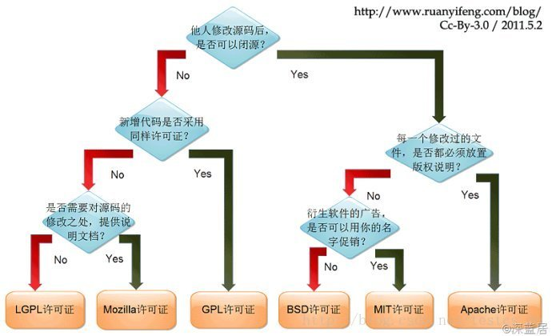

# 开源许可证

- [开源许可证](#开源许可证)
  - [选择开源许可证的依据](#选择开源许可证的依据)
  - [开源协议中的核心概念](#开源协议中的核心概念)

## 选择开源许可证的依据

> [阮一峰的日志](http://www.ruanyifeng.com/blog/2017/10/open-source-license-tutorial.html)  

开源许可证主要分为两种：
- 宽松式许可证
- *Copyleft*许可证

宽松式许可证主要包括BSD、MIT、Apache等开源协议。对用户几乎没有限制，可以在修改代码后闭源，也可以用作商业用途。它们之间区别在于要求用户遵守的条件不同：
- *Apache 2.0 license*：分发软件时，必须保留原始的许可证声明。凡是修改过的文件，必须向用户说明该文件修改过；没有修改过的文件，必须保持许可证不变。(主要用于保护原作者著作权，以及名声。)
- *MIT license*：分发软件时，必须保留原始的许可证声明，与 BSD（二条款版）基本一致。
- *BSD*(二条款版)：分发软件时，必须保留原始的许可证声明。
- *BSD*(三条款版)：分发软件时，必须保留原始的许可证声明。**同时**不得使用原始作者的名字为软件促销。

*copyleft* 是*stallman*发明的一个词，作为 *copyright* 的反义词。*copyright* 直译是"复制权"，这是版权制度的核心，意为不经许可，用户无权复制。作为反义词， *copyleft* 的含义是不经许可，用户可以随意复制。但是其限制条件比宽松式许可证要多：
- 如果分发二进制格式，必须提供源码
- 修改后的源码，必须与修改前保持许可证一致
- 不得在原始许可证以外，附加其他限制

上面三个条件的核心就是：修改后的 *Copyleft* 代码不得闭源。
具体主流协议有GPL、AGPL、LGPL等协议。
- Affero GPL(AGPL)：如果云服务（即 SAAS）用到的代码是该许可证，那么云服务的代码也必须开源。
- GPL：如果项目包含了 GPL 许可证的代码，那么整个项目都必须使用 GPL 许可证。
- LGPL：如果项目采用动态链接调用该许可证的库，项目可以不用开源。
- Mozilla (MPL)：只要该许可证的代码在单独的文件中，新增的其他文件可以不用开源。

## 开源协议中的核心概念
> 材料参考[唐容](https://developer.aliyun.com/article/57148)
- 分发(distribute)：指版权作品从一个人手中转移至另一个人，如果是个人单独使用，则不会存在违反协议的情况，不需要遵守许可证。（此处人可以指法人，即开源软件可以在公司内部使用，不需要遵守许可证）
- 衍生作品(Derivative Works)：
  - 修改开源源代码 ，改了代码肯定算衍生作品了。
  - 把我们的源代码和开源源代码组合在一个文件里编译(即等于修改开源源代码)，一起编译也算哦。
  - 最难理解的一种情况，我们的程序链接开源程序，是否生成衍生作品?
    - GPL: 静态链接生成衍生作品; 动态链接(即程序运行时才生成链接)，是否生成衍生作品没有法律定论
    - 其他大多数开源协议(包括“病毒”型协议): 链接不生成衍生作品