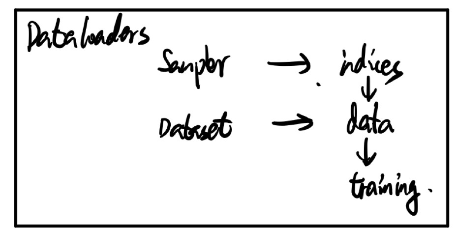

# Python学习笔记


- [Python学习笔记](#python学习笔记)
    - [迭代器（iterator）与生成器（generator）](#迭代器iterator与生成器generator)
    - [dataloader与dataset](#dataloader与dataset)
    - [File open](#file-open)


## 迭代器（iterator）与生成器（generator）
- 迭代器：指实现了`__next__()`与`__iter__()`方法的对象
- 生成器：生成器的建立有两种方式：
  - 1、使用生成式表达式建立生成器`(i for i in range(10))`
  - 2、使用`yield`建立生成器

    ```python
        def _generator(num=10):
            for i in range(num):
                yield i
    ```

  生成器也具有`__next__()`与`__iter__()`方法，是迭代器的一种。使用迭代的方式能够将数据作为数据流读入，防止同时占用大量内存。
 
  需要注意`iterable`与`iterator`区别，只包含`__iter__()`方法的对象不是`iterator`，但是是`iterable`对象，可以使用`for,list`等方式读取，因为其`__iter__()`方法可以返回`iterator`对象。

  `__iter__()`方法需要返回`iterator`对象，即含有`__next__()`方法。否则使用迭代方式如`list`,`for`循环读取时将会陷入死循环。因为这些循环方法先会调用调用`__iter__()`函数，再调用`__next__()`方法。对于已经含有`__next__()`方法的`iterator`对象，其`__iter__()`方法返回其自身。
 
  `yield`返回方式与`return`有些不同，`yield`返回时记录返回时代码执行的位置，下次循环调用`__next__()`时从上次停止的地方开始执行。

  ```python
  def odd():
      print('step 1')
      yield 1
      print('step 2')
      yield(3)
      print('step 3')
      yield(5)

  >>> o = odd()
  >>> next(o)
  step 1
  1
  >>> next(o)
  step 2
  3
  >>> next(o)
  step 3
  5
  >>> next(o)
  Traceback (most recent call last):
    File "<stdin>", line 1, in <module>
  StopIteration
  ```

  > 廖雪峰的[python教程](https://www.liaoxuefeng.com/wiki/1016959663602400/1017318207388128)
- 迭代器与生成器的判别方法：

  ```python
  from collections.abc import Iterator, Iterable
  from inspect import isgenerator

  isinstance(obj, Iterator)
  isinstance(obj, Iterable)
  isgenerator(obj)
  ```

## dataloader与dataset
- dataloader与dataset之间的调用关系如图

其中`Sample`是`iterable`对象，其`__iter__()`方法返回一个`iterator`对象，`torch.utils.data.Dataloader`通过调用`next(iter(Sample))`得到`indices`。再通过调用`dataset[indices]`得到数据流。

  源码如下

  ```python
  class DataLoader(object):
      ...
      
      def __next__(self):
          if self.num_workers == 0:  
              indices = next(self.sample_iter)  # Sampler
              batch = self.collate_fn([self.dataset[i] for i in indices]) # Dataset
              if self.pin_memory:
                  batch = _utils.pin_memory.pin_memory_batch(batch)
              return batch
  ```
  
  > pytorch 1.0 document，高版本的dataloader将`__next__()`方法去除了，实现更为复杂，但流程相同。

## File open文件操作
- `file.write(str)`写入字符串
- `file.writelines(sequence)`写入序列字符串列表
- `file.next()`返回文件下一行
- `file.readline([size])`读取整行
- `file.readlines([sizeint])`读取所有行并返回列表，若给定`sizeint>0`，则是设置一次读多少字节，这是为了减轻读取压力。
- `file.seek(offset[, whence])`方法用于移动文件读取指针到指定位置。
  - offset -- 开始的偏移量，也就是代表需要移动偏移的字节数
  - whence：可选，默认值为 0。给offset参数一个定义，表示要从哪个位置开始偏移；0代表从文件开头开始算起，1代表从当前位置开始算起，2代表从文件末尾算起。
