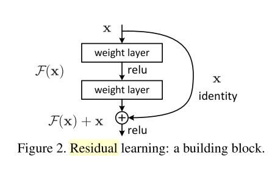
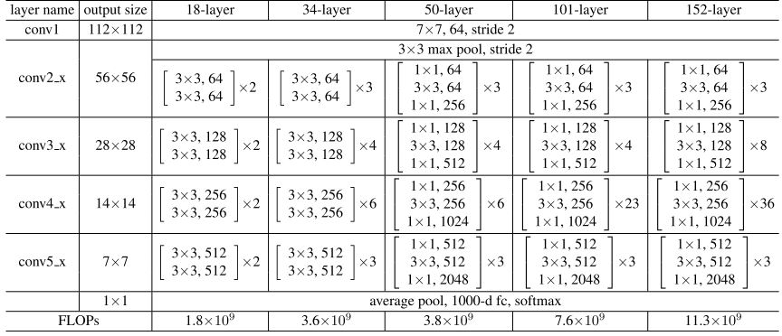

# Pytorch学习笔记

- [Pytorch学习笔记](#pytorch学习笔记)
  - [dataloader与dataset](#dataloader与dataset)
  - [CUDA的使用](#cuda的使用)
  - [Batchnormal层的使用](#batchnormal层的使用)
  - [ResNet解析](#resnet解析)

## dataloader与dataset
- dataloader与dataset之间的调用关系如图

  > 图参考 https://zhuanlan.zhihu.com/p/76893455

  其中`Sample`是`iterable`对象，其`__iter__()`方法返回一个`iterator`对象，`torch.utils.data.Dataloader`通过调用`next(iter(Sample))`得到`indices`。再通过调用`dataset[indices]`得到数据流。

  源码如下

  ```python
  class DataLoader(object):
      ...
      
      def __next__(self):
          if self.num_workers == 0:  
              indices = next(self.sample_iter)  # Sampler
              batch = self.collate_fn([self.dataset[i] for i in indices]) # Dataset
              if self.pin_memory:
                  batch = _utils.pin_memory.pin_memory_batch(batch)
              return batch
  ```
  
  > pytorch 1.0 document，高版本的dataloader将`__next__()`方法去除了，实现更为复杂，但流程相同。

## CUDA的使用
- `pytorch`中无论模型的参数还是数据均以`tensor`的形式存储。`tensor`的运算均需要运算数在同一设备中，否则将会报错。

  ```python
  import torch
  a = torch.tensor([1,2,3,4], device=torch.device('cuda'))
  b = torch.tensor([2,3,4,5], device=torch.device("cpu"))
  c = a + b

  ---------------------------------------------------------------------------
  RuntimeError                              Traceback (most recent call last)
  <ipython-input-1-3317b81b183d> in <module>
        2 a = torch.tensor([1,2,3,4], device=torch.device('cuda'))
        3 b = torch.tensor([2,3,4,5], device=torch.device("cpu"))
  ----> 4 c = a + b

  RuntimeError: expected device cuda:0 but got device cpu
  ---------------------------------------------------------------------------

  c = a + b.cuda()
  c

  >>>tensor([3, 5, 7, 9], device='cuda:0')
  ```

## Batchnormal层的使用
具体原理参考[Juliuszh的高赞文章](https://zhuanlan.zhihu.com/p/33173246)
- `torch.nn.BatchNorm2d(num_features, eps=1e-05, momentum=0.1, affine=True, track_running_stats=True)`  
针对每个channel，给一组映射参数$\alpha$, $\beta$, 长度为`C`
    - **num_features** - C from an expected input of size `(N,C,H,W)`
    - **affine** - a boolean value that when set to True, this module has learnable affine parameters. Default: `True`
    - **track_running_stats** - a boolean value that when set to `True`, this module tracks the running mean and variance, and when set to `False`, this module does not track such statistics and uses batch statistics instead in both training and eval modes if the running mean and variance are None. Default: `True`  
  
  ```py
  import torch
  import torch.nn as nn
  w = nn.BatchNorm2d(100)
  m = nn.BatchNorm2d(100, affine=False)
  n = nn.BatchNorm2d(100, affine=False, track_running_stats=False)
  input = torch.randn(20, 100, 35, 45)
  output_w = w(input)
  output_m = m(input)

  print(w.state_dict().keys())
  print(m.state_dict().keys())
  print(n.state_dict().keys())
  print(output_m.size())
  print(output_w.size())


  >>> odict_keys(['weight', 'bias', 'running_mean', 'running_var',  'num_batches_tracked'])
  >>> odict_keys(['running_mean', 'running_var',  'num_batches_tracked'])
  >>> odict_keys([])
  >>> torch.Size([20, 100, 35, 45])
  >>> torch.Size([20, 100, 35, 45])
  ```

## ResNet解析
- resnet架构如"[Deep Residual Learning for Image Recognitin](https://arxiv.org/abs/1512.03385)"所述，由残差块`residual block`堆叠而成，其具体结构如图所示：
  <div  align="center"> 
  
  </div >
  

  其网络整体结构如下：
  <div  align="center"> 
  
  </div >

  具体来说，实验使用较多的为`resnet18`即18层的`resnet`。论文中所有`resnet`均由4个"大"`layer`组成，每个`layer`按结构不同又可以由不同数量的`block`构成。
  `block`又由卷积层与`batchnorm`层组成。`block`有两种基本结构：`BasicBlock`与`Bottleneck`。
  - `BasicBlock`含有2层卷积层
  - `Bottleneck`含有3层卷积层
  
  每个卷积层后均使用`batchnorm`进行归一化，具体实现可参考[pytorch源码](https://pytorch.org/docs/stable/_modules/torchvision/models/resnet.html#resnet18)